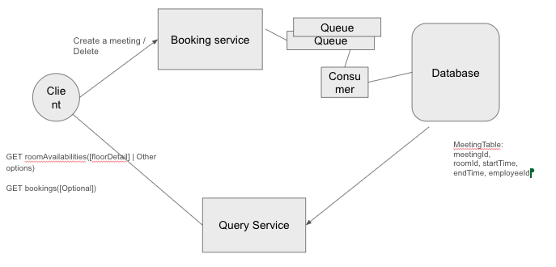

### High level requirement

Design a meeting room system reservation system. There are five meeting room. A meeting room can be open, reserved to a user, or in maintenance and not able to be reserved. We have 20 users who can request reservations concurrently through the application. A reservation can be 1, 2, 3, or 4 hours long and have a start and end time.

#### About the system

Scale: 
- 20 users
- 1 million users
- System can peak during large events

How the system is used:
- Internal facing system
- Used by employees to book rooms

Cost considerations:
- 10 servers.. 
- Medium cost 
- Next 5 years

#### **Functional Requirements:

- Book a meeting
- Check For Room availabilities
- See booked meeting
- Delete meetings

APIs:
- POST bookMeeting(roomId, startTime, endTime, employeeId) | 201
- GET roomAvailabilities([floorDetail] | Other options)
- GET bookings([Optional])
- DELETE deleteMeeting(meetingId)

Deployment Strategies and Data Updates:
- Split it by environments
- CI/CD Pipeliens - testing- unit and integration testing
- Load testing
- Golden images
- Roling deployment

### Non Functional Requirements

- Highly available to allow users to book it 24/7- especially during peak hours,    
- Scalable - automatically can hanle more concurrent users, more rooms in the system
- Consistency - trustworthy
- Durable - booked meetings cannot be lost
- Performance requirement - fast and nimble
- Latency - get meeting details within 1 second
- Handle issues that comes around around the world - locks and measures

Easy to integrate.. Monitoring system internal , be prudent about the serers and services we use cost .. well tested..

