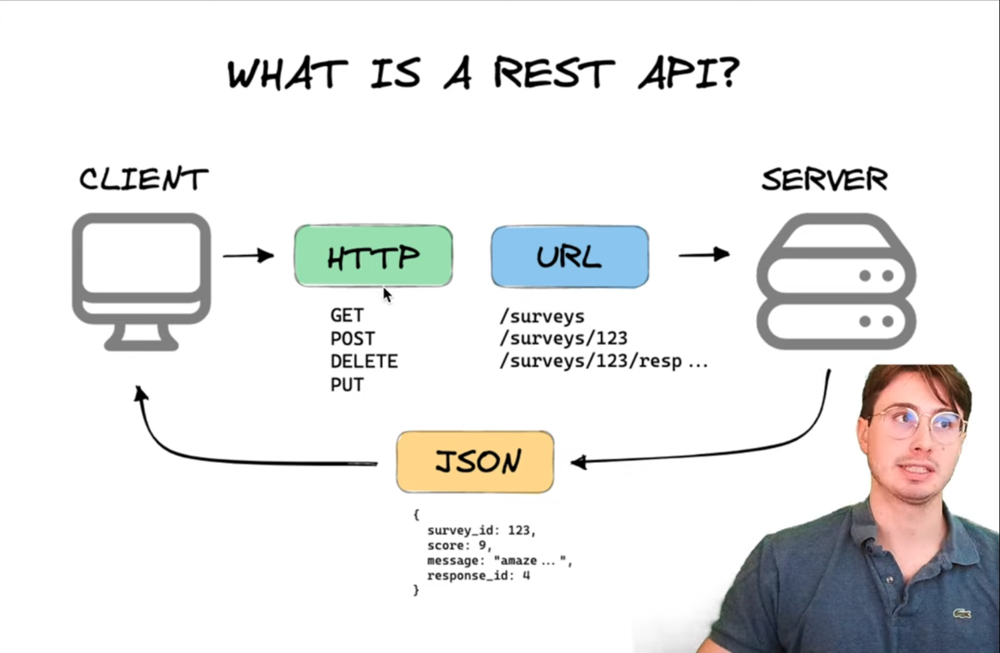

REST API stands for Representational State transfer

This is what we can think of when we want to perform actions like POST, PUT, GET and DELETE.

#### Characteristics:

**Stateless:**
- They are completely `stateless`
- While they contain information about what the target resource is, they don’t have to do any logic / action by themselves
- So every time we make a request, it needs to contain all the information that needs to be present for the request to be processed, we should not rely on the previous execution or anything state data of sort while using REST APIs

**Saclable**
- These kind of APIs are `highly scalable` because they don’t depend on anything other than the server that has to serve the request, we can `easily bring in multiple clients to use the same API` as long as the existing server can handle the load

**Performant:**
- They bring in the `caching capabilities` that come with HTTP mechanisms, where we can use request headers to mention that we want to cache a particular response or not, so that subsequent requests from the same client can have the cached data returned to them

**Variety of Data formats :**
- Apart form text, REST Apis can support various types of formats like JSON, XML etc..

### CONS:

**Not suitable for stateful API requirements :**
- Sometimes applications require a steady state, suppose we are playing a game and we have multiple players interacting with each other, an a player shoots to other player, and the other one fires back, in this situation where there is a to and fro communication between the client and multiple servers, we might need the API to be Stateful so in this case a REST API might not work in our favor

**OVER FETCHING and UNDER FETCHING :**
- Suppose we have an API that has been defined to fetch one part of the data, but if we need to fetch a larger model of the data from the server, then we will have to perform multiple API calls , possible multiple different api calls to fetch parts of the data and form the required response. This is called under fetching
- And similarly if we only require a very small part of a given object, unless there is a very specific API that does it, REST Apis usually return the object as it is, so it send unnecessary data over the network, consuming additional bandwidth
- In both the above cases, we see that either we need to do multiple API calls or we need to fetch excess data ,,or we will have to write additional end points to solve our very specific problem, this is a drawback of REST APIs