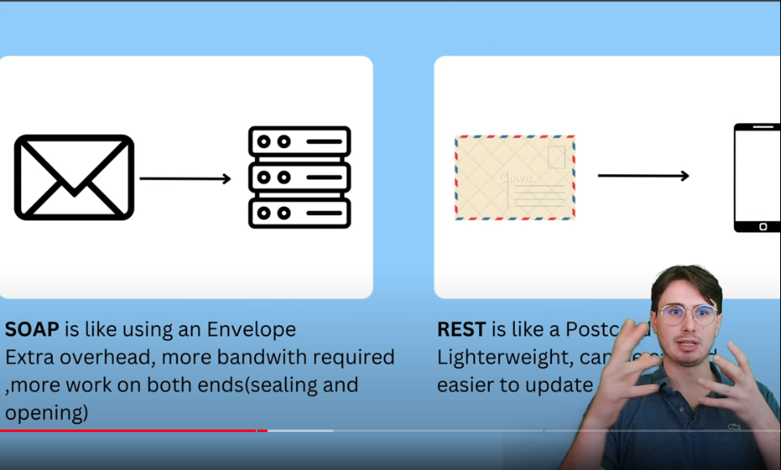

**Simple Object Access Protocol**
 

These APIs are `Protocol Independent` and can run over any protocol. These `don’t need HTTP` and can run over other protocols and they are really known for their` strict standards and security.`

#### Characteristics:
- Built in Error Handling
- Support for security
- Less free form than a REST API
- All the APIs and END points must conform to a specific format so that we know they will be in the right format when we access that

Here is an example of SOAP API
![[SOAP API Example.png]]

Here we can see it follows an XML format, and there are a lot more details that we need to pack in with the API body to complete the API Call. 

But this brings in more security.

#### Cons
- It is more complex and heavier
- We have to perform more operations to form the api body
- Need more compute over head
- Their verbosity of the xml file can affect performance

> While this is more organized and standardized than a JSON request, it is a pain to manage and requires more overhead, might not be suitable where bandwidth is a constrain
.

Not the best choice when it comes to performance.

