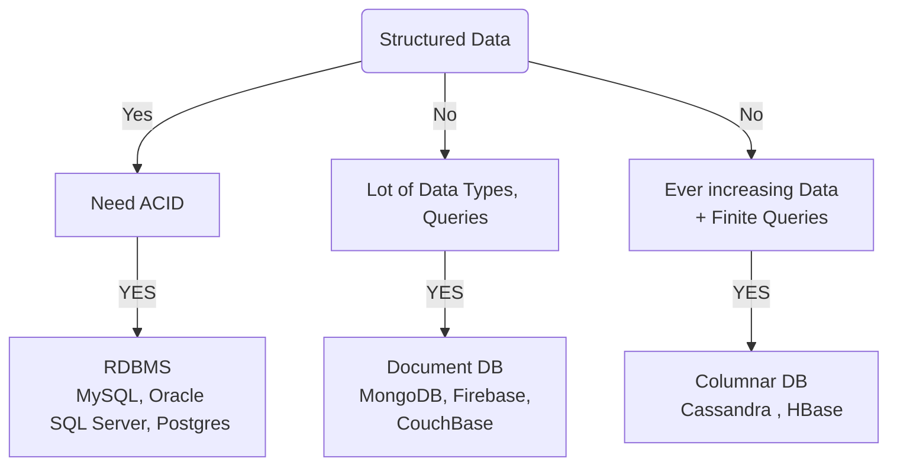

### Factors to decide the database type
- Structure of the data 

#### Structured Data
- Any form of information that can be modeled in form of rows and columns
- Example user information - Name, City, Phone Number, Age
- Standard fields that each user will have

### Choices

#### RDBMS: **If we have a structured data and we need atomicity and transactional guarantees, we need to go with a RDBMS.** 

Examples of systems that need a transactional Database 
- Banking systems, 
- Booking Systems

Our databases need to provide us with transactional guarantees. For example, in a banking system, when we log a transaction, money is always debited from one account and moved to another account. So both of these transactions together and then committed to the database. It should never happen that money was debited from  `account A` but never got credited into `account B`. And similarly, it should never happen that money was failed to get debited from `Account A`, but got credited in `Account B`.

### Document DB : If we have structured data but we DO NOT need ACID guarantees

In this case, we can still go with a relational database, or even go with a document database like Mongo DB. It wouldn’t make much of a difference if the ACID requirement isn’t there.  Structured data can be converted to JSON documents as well and stored in databases like MongoDB, Couch Base or Firebase

#### Say we do not have structured data

Suppose we are building a catalog of products on a system like Amazon. Each product would have certain attributes, and these attributes could be different across products and product types. 

We can now convert this to a JSON and dump it into either a SQL or a NoSQL database like a document DB. 

But the difference comes when we actually want to query data on these attributes. 
Querying on a JSON or random attributes are A bit tricky when it comes to Relational Databases, but can be done in Document Databases.

#### So if we have a lot of data in terms of structure of the data and each product having different attributes +  we want to query this data on those different attributes, a Document Database like MongoDB or CouchBase can come in handy. 

> Earlier we saw Elastic Search and Solr for text searching, those are special cases of a document database.

So say we have semi structured data, and we have some queries that we can do and not a lot of queries, we can still use a document DB unless it falls into the 3rd category of ever increasing time based data.

### Columnar Database Ever increasing Data 

When we have data that is increasing in more than a linear fashion we can use a column oriented database. 

So this is for ever increasing data and finite number of queries and not a lot of analytical processing, then we would have to look at OLAP databases and warehouses.

**Cassandra and HBase** are the most stable for these scenarios.

