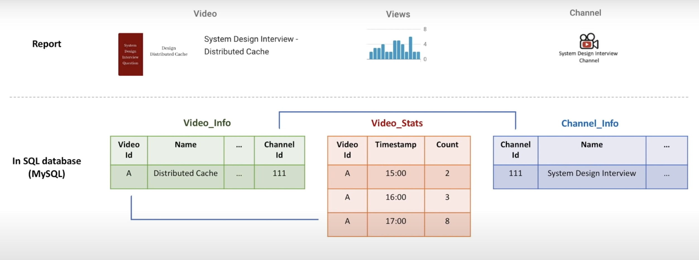
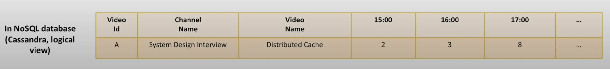

There is a big difference on how we do data modeling for SQL and NoSQL Databases. 

We start with creating `nouns` to represent the various entities in the system, convert the Nouns to tables and we use `Foriegn Keys` to related data in these tables.

Let's look at the current example: We want to build a report that shows the following entities:
- Information about the `Video`
- Number of total `views` per hour for the last several hours
- Information about the `channel` for this video

We pass `videoIdentifier` as the input for this report.

In a relational database, we would define the following three tables: 
- `Video Information Table` that contains information about videos
- `Video Stats Table`, that accumulates `ViewCount` per hour 
- `Channel Info Table` that contains information about the channel

And to create the report mentioned above, we create a JOIN table, that retrieves information from the above three tables.

#### Data Normalization and De Normalization

- Each entity in the system has a separate table associated with it
- To serve requests, data across multiple tables is joined to return the response
- This is called Data Normalization, which is an important property of a Relational Database
- In Normalized representation of data, data duplication across tables in minimized: Example, `VideoInfo Table` only has information such as `name, description, userId, ChannelId` etc.. and we don't store this information in any other table
- Because if some `Video Name` changes, we will have to change it in several places, that may lead to inconsistent data
- Therefore normalization is good for relational databases

#### NoSQL Databases Promote a Different Paradigm

While working with NoSQL Databases, the idea is not to think from `nouns` but from `queries` that we will be executing. 

It is about how we store the data, and instead of having separate tables, for each entity, we have a single data for storing the data in the exact form that is required to be retrieved by the query. Denormalization is perfectly normal and there is nothing to be afraid of.

In Cassandra, the report mentioned above is stored as mentioned in the following table: 

**Instead of adding rows as in relational database, we keep adding columns for every next hour !**

Go To [[15 Types of NoSQL Databases]]