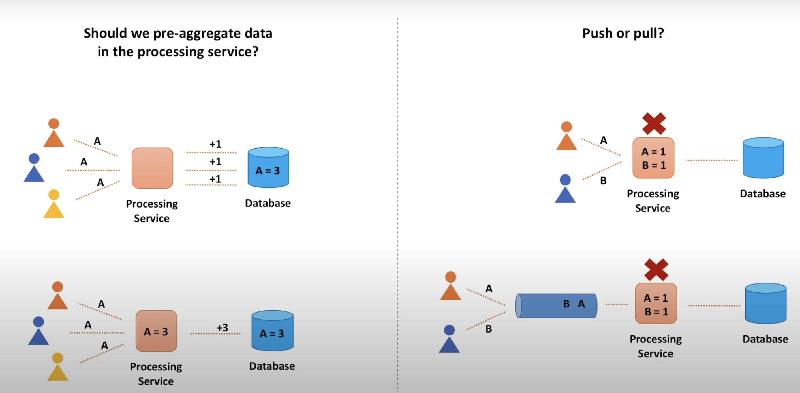
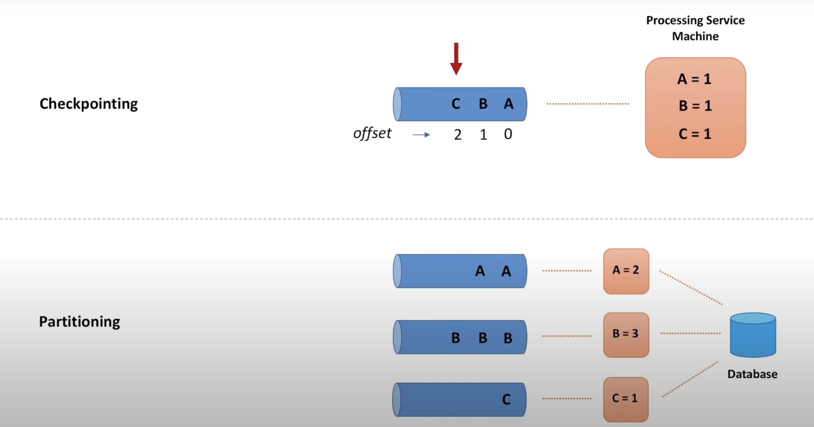

**Should we pre-aggregate data in the processing service ?**

There are two ways in which we can update count data in the database. 

When users watch the video, for every single view, we can update the counter in the database.

or

We aggregate count values for some given time period and update the database at a given cadence

Which one is a better approach for large scale systems ? 

I feel that aggregating count values for a brief period and then updating the database would serve better, because this way we can reduce load on the database server, with lesser number of writes. But what about cases where the backend service that accumulates these count values goes down ? How can we ensure this does not happen ?

If we update the database every time a view event happens, then there are lesser chances of losing data , but a higher load on the database server.

---------------------------------------------

**Push or Pull ?**

- In case of Push Architecture, the messages are erased from the storage once it is pushed to the consumer. But what if the backend service goes down before updating the aggregated data in the database. this causes loss of data
- In this case a pull method is a better fit. Until the processing service completes processing the data and updates it in the database, it need not be deleted from the temporary storage, it can be marked as invisible, but not deleted. Once the database is updated, the processing service can manually delete the messages from the temporary distributed storage so that other instances of the processing service do not re process this message.
 
---------------------------------------------------

**Checkpointing**

- Checkpoint refers to the offset in the queue until which the processing service has successfully completed processing messages. 
- The checkpoint is incremented by 1 once every message is successfully processed
- This checkpoint information can be separately stored in a table 
- When the current processing server goes down and is replaced by another processing server, it can start processing messages from that particular checkpoint ( offset value )

**Partitioning :**

- Partitioning is how we distribute data across multiple queues, in case of video event processing, the `videoId` can be hashed to decide the queue in which it can be sent to
- This way multiple processing services can pick up events from the queue and store it in the distributed database system
- This increases the scale of processing - more events we get more partitions (queues) we create

