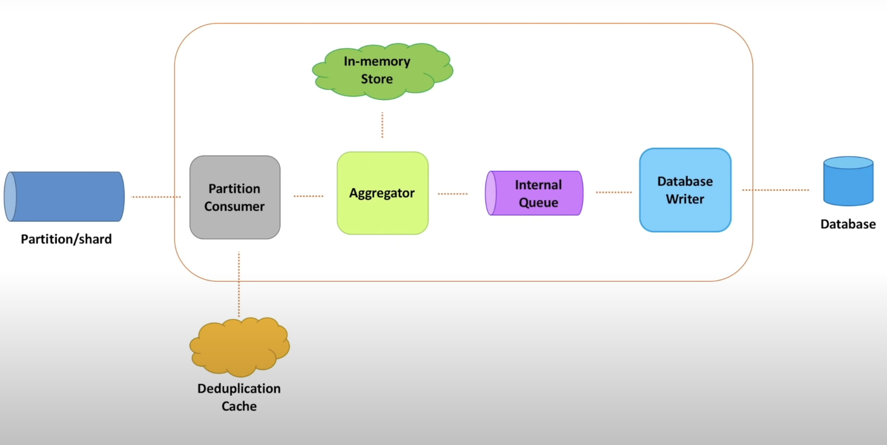

We saw so far that the processing service reads events from partition one by one, counts the views and updates it to the DB, let's now have a look at how it does it internally.

**Partition Consumer**:

- This is a single threaded component that consumes messages from the selected partition and passes it to the aggregation service. This runs as an infinite loop and keeps polling for data from the partition. Here strategies like long polling can be employed if required to reduce the number of times the consumer checks for data from the partition

Why single threaded ?
- Since we need to maintain an offset, it is much easier to have this run in a single threaded manner so that messages are consumed one at a time. It is hard to preserve ordering of messages if the messages are consumed in a parallel manner from a queue.

**Distributed, message deduplication cache:**
- Additionally, a distributed cache can be employed to temporarily store the messages that were processed in the last 10 minutes, this way if any identical message arrives within the 10 minute window that has the same hash and content, it can be ignored

**Metric Aggregation Service:**
- The message aggregation service can now aggregate the metrics and send it for further processing. 
- To ensure high performance, we can think of this as using an in-memory store hash table that aggregates data for a certain amount of time
- Periodically, values are stored in a new hash table as events are no longer required to be written to the old hash table, the various counts from this hash table are sent out for further processing
- While the partition consumer was single threaded to ensure consistency in the check point increments, the output of the metric aggregation service need not be processed in a single threaded manner

**Internal queue and Database Writer service** :
- The message aggregation service can then push the aggregated metric values to an internal distributed queue service, from which we can have Database Writer service instances write the processed data to the database in parallel.
- This ensures that aggregated data is written to the database as soon as it is made available
- Similarly the checkpoint can only be updated, once a message is written to the database so that all other processing services know form which checkpoint to work from

Should the database writer service processes messages in a single threaded or multi threaded manner ?

> Since the checkpoint is updated based on the order in which messages were processed, if we process it in a multi threaded manner, then data would be updated in the database in a different order, which might prove difficult for debugging when this happens at a large scale. In case we are tracking the order in which messages were written to the DB or even the order in which they were processed, it might be difficult. But this is a tradeoff with processing speed that has to be discussed.

Additionally as discussed before, the messages in the distributed queue need not be deleted immediately and can be erased after a given number of days based on the message retention policy.

