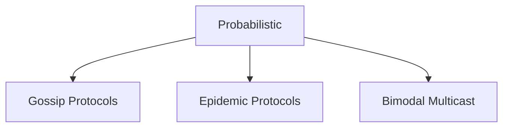
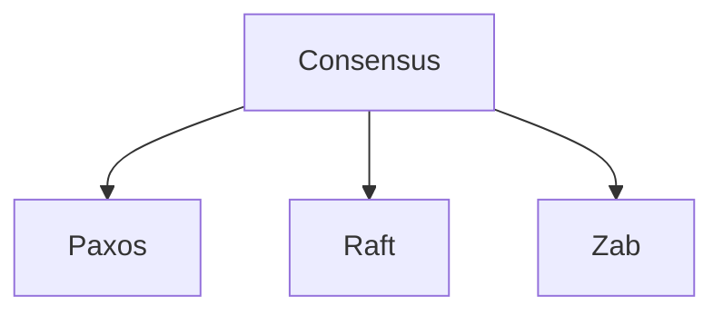

https://www.geeksforgeeks.org/what-is-replication-in-distributed-system/#types-of-replication-in-distributed-systems

There are many techniques for Data Replication. We can split them into two categories of Data Replication Protocols. 

https://www.linkedin.com/pulse/replication-consensus-protocols-yeshwanth-n/

**Probabilistic Protocols:**
> *These protocols tend to favor eventual consistency*

**Consensus Protocols:**
> *These protocols tend to favor strong consistency*

#### **Let's keep things simple and follow Leader - Follower ( Master Slave Configuration )**

The master slave architecture follows a simple pattern, there is a leader node and there are multiple follower nodes. 

The leader nodes handles both read and write requests, while the followed nodes only follow the read requests. 

The replicas try to be an exact copy of the master. If the connection from the lead node gets disconnected, the replica nodes attempt to reconnect to the master. 

And to ensure high availability, the replica nodes are present in different data centers, so that data is still available even if one of the nodes go down. 

Now that read requests are handled by read replicas, we can add more read replicas to scale out hot shards.
![[Screenshot 2024-08-26 at 6.07.14 PM.png]]

### How are Leaders Elected ?

There are two options - we can rely on a separate component, or we can implement leader election in the cache service.

##### Using a configuration service

A configuration service can be used for both monitoring leaders and followers and failover. If some leader is not working as expected, the config service can promote one of the followers to leader. 

Cache clients can use this config service to discover cache servers. 

