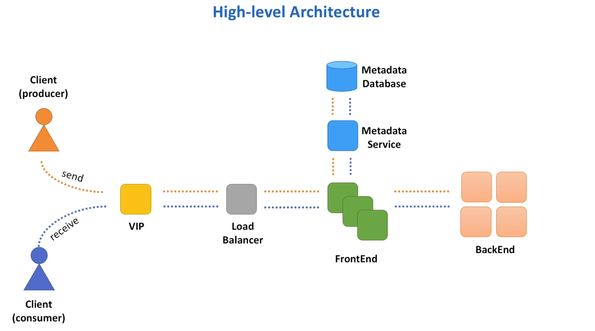

### Common Components for distributed architectures

Virtual IP: 
- VIP refers to a symbolic host name that represents `myservice.domain.com` that resolves to a load balancer system

Load Balancer: 
- Routes client requests across a number of servers

Frontend Web Service:
- Component responsible for initial request processing, like validation, authentication etc..

Database:
- Queue metadata like, name, creation date, time, owner and other config settings will be stored in a database

Metadata Service:
- Best practices dictate that databases should be hidden behind some facade, a dedicated web service that handles calls to the database

Backend Web Service:
- We need a place to store queue messages, so let's introduce a backend web service that will be responsible for message persistence and processing

Next:  A brief on [[03 VIP and Load Balancing]]