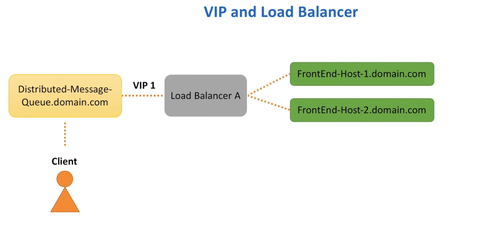
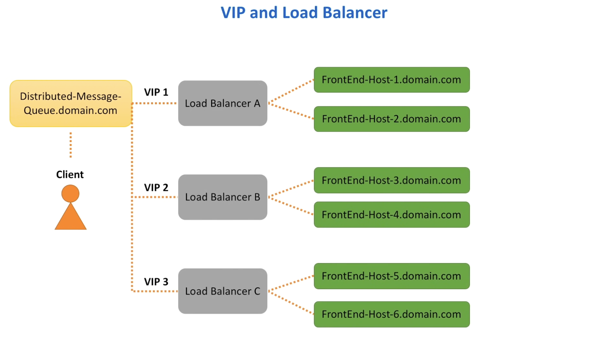

Load balancing is a big topic. Unless the interviewer asks you to specifically dive deeper into this topic, it is better to stay focussed on the main aspect of the distributed queue system.

While the internals of the load balancer might not be that important for this problem statement, in order to ensure that the non functional requirements that we built for the system are fully met, it is important to illustrate how having a load balancer will help us achieve high throughput and availability. 

Process:
1. When the domain name is hit, the request is transferred to one of the VIPs registered in Domain Name System for our domain name
2. VIP is resolved to a load balancer device that has the knowledge of our frontend hosts

#### Question:
- Isn't the load balancer a single point of failure in this case ?
- What happens if load balancer if the device goes down ?
- Load balancers have limits to the number of requests that they can process and number of bytes that they can transfer - what happens to the distributed messaging queue service when the number of messages go up and the Load Balancer limits are reached ?

#### Handling load at the VIP and Load Balancer Level

To handle higher amount of load, load balancers can employ a multi node setup where the primary node will receive connections and serve requests and the secondary node monitors the primary. And for any reason if the primary node is unable to accept connections, the secondary node takes over. 

As for scalability concerns, the concept of multiple VIPs (or) VIP partitioning can be utilized. For example in DNS, we can assign `Multiple A records` for the same DNS name for the service. As a result, the results are partitioned across several load balancers. And by spreading load balancers across several data centers, we increase availability and also performance. 

