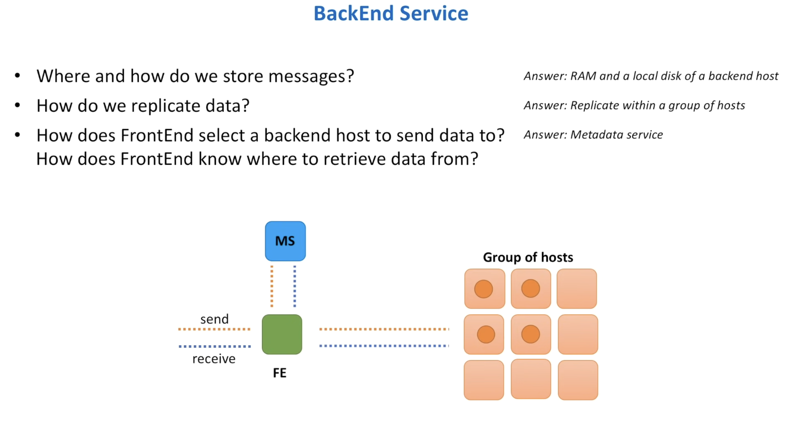

Before we start imagining how the backend service architecture might look like, let's start answering some important questions first. 

> Note: If you ever find yourself stuck in an interview, start by asking yourself questions. This helps with breaking down the problem into more manageable chunks. And it also allows to establish a better communication channel with the interviewer. Interviewer will let you know whether you are on the right path or not.

### Questions to define the backend system better:

**Where and how do we need to store messages**

Can we use a database for this purpose ? 
	
	It is an option, but not the best option. We are building a distributed message queue. Which is a system that can handle very high throughput. This means the database must also handle such high throughput. 
	
	Therefore a problem of building a distributed message queue, converts into a problem of building a distributed database that can hold such high throughput.
	
	One way the interview can proceed from here --> Walk me through how one can build a distributed database.  -> topic for research

But if not a Database , what other option can we use to store data ?

***What about memory or file system ?*** 

As we might have to store messages for days or even weeks, we might need a more durable storage solution like a local disk. At the same time newly arrived messages might live on memory for a short period of time, or until the memory on the backend host is fully utilized. 

***How can we replicate data ?***

We will be sending copies of messages to some other host, so that data can survive, hardware or software failures. 

***How can fronend host select backend host for storing and retriving messages ?***

We can use the metadata service for this.

Next Goto [[07 Backend Service Architecture Deepdive]]