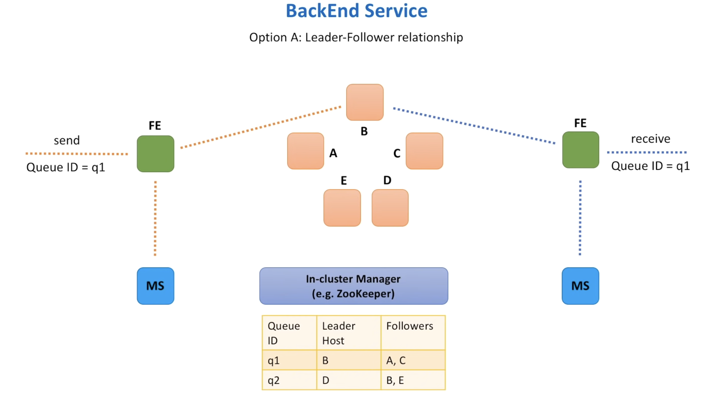

### What are the different systems that can be employed along with the backend service to pick the right host

#### Option A: Leader-Follower Relationship

- In this setting, each backend instance is considered a leader for a particular set of queues. 
- All requests like send and receive message for a given queue go to the same leader instance
- Whenever a request is received, the metadata service identifies which host is the leader for this queue
- The leader instance is responsible for replicating the message to all follower instances, 
- Similarly once the message is read from the queue, the leader is responsible for cleaning up the message from all replicas
- We can use a separate in-cluster manager to help with leader election
- It maintains a mapping between the queue, leaders and followers for each queue

Building and maintaining the in-cluster manager component is an operational overhead. So one thing we must look out for is if we can avoid the requirement to select a leader and if all nodes can be treated as equal.

#### Option B: Small cluster of independent hosts

- We have a set of small clusters and each cluster consists of three or four hosts spread across several data centers
- When the frontend service receives messages, similar to the previous option, it sends a request to the metadata service that tells use which cluster to store the message in for the given queue
- We make a call to randomly selected instance in the cluster
- The randomly selected instance is responsible for replicating the messages across the cluster
- Similarly when the FE Service receives a message, it picks the cluster id from the Metadata service and calls a randomly selected host to retrieve the message
- The selected host is responsible for cleaning up messages from all clusters

Here we no longer need a component for leader election, but we need something to manage queue to cluster mapping. We can call this the queue-cluster manager.

What does the metadata service do ? I thought all this data will be stored in the database ..

THe queue-cluster manager will be responsible for maintaining mapping between queue and cluter.

#### Is this a better option at the end of the day ?

| **Queue-host manager**                                    | **Queue-cluster manager**                                         |
| --------------------------------------------------------- | ----------------------------------------------------------------- |
| Manages queue assignment within the cluter                | Manages queue assignment amongst clusters                         |
| Needs to know about each and every instance within cluter | Needs to maintain a list of cluters                               |
| Monitors heartbeats form hosts                            | Monitors cluter health                                            |
| Deals with leaders and follower failures                  | Deals with overheated clusters - scaling up cluster if required ? |
| Partition queues across cluster nodes                     | Partitions queue across cluters                                   |

How do we ensure order of messages if we have it in a distributed manner ? When data is partitioned across clusters / nodes how does this happen ? 

