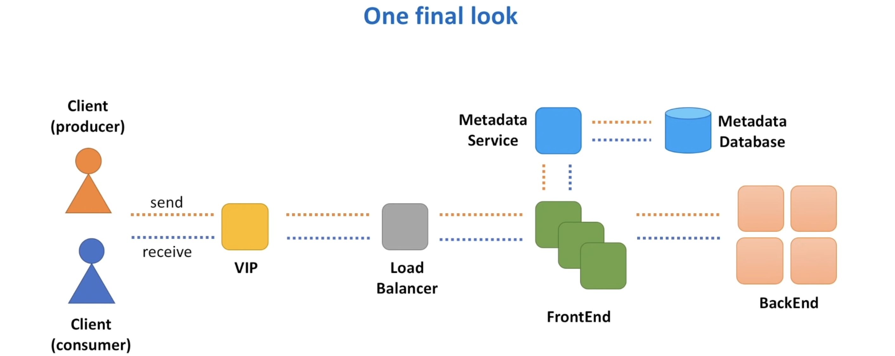

Let's look at the architecture we built and evaluate if the non functional requirements are fulfilled: 

Is the system **scalable?**:
- Every component in our system is scalable. As the load increases, we can add more VIPs, more load balancers, more Frontend Hosts, more Metadata Service cache shared and more backend hosts

Is the system **highly available?**
- As there is no single point of failure
- Each component is deployed across several data centers
- Individual hosts may die, network partitions may happen, but with the redundancy in place, the system continues to operate

Is the system **highly performant** ?
- This depends on the performance of each individual component, the underlying hardware and the network setup of the data centers

Is the system **durable ?**
- We replicate data while storing and ensure messages are not lost during transfer from a producer to consumer using TLS over HTTP
- (Hyper Text Transfer Protocol)