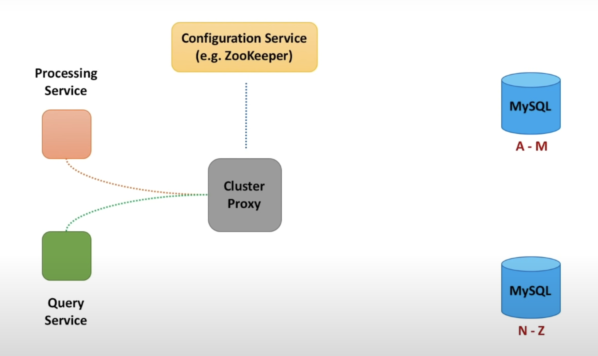
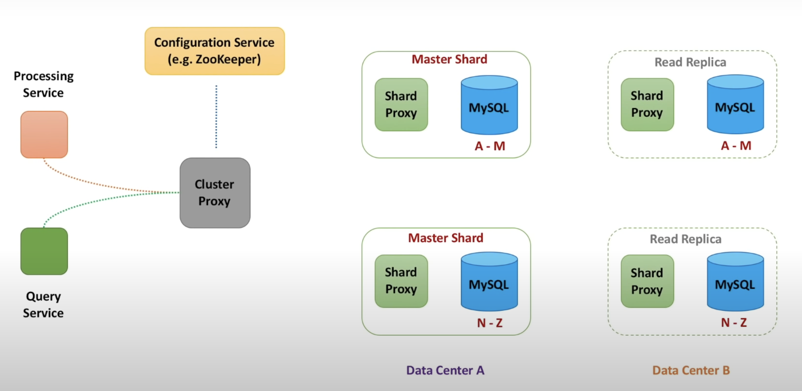
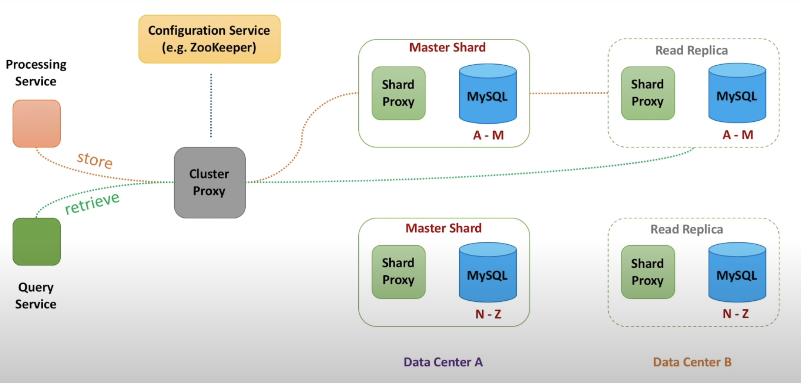

Let's see how SQL databases handle the non functional requirements.

When it is difficult to store all data on a single machine, data is split across multiple databases using the process called sharding or data partitioning. Each shard stores a subset of each data. 

Services that talk to each database, need to know how many shards exist and which shard to pick for a particular request. 

We mentioned before that the Processing Service writes data to the database and the query service reads data from the database. We can embed the logic to pick the right shard within these services, but a better way would be to introduce a LightWeight Cluster Proxy that decides which shard to route the data to. 

Thus both the processing service and the query service talk to the Cluster Proxy.\

#### How does the cluster proxy work

Along with routing the request to the right shard, the cluster proxy has several other tasks
- It needs to know how many shards exist at any given point in time
- When some shard dies or becomes unavailable due to network partition
- If new shard has been added to the database cluster, the cluster needs to be kept aware of it
- This can be achieved using a `configuration service`. This service maintains a `health check connection` to all shards and maintains a list of machines that are currently available

The cluster proxy calls a particular shard. But instead of calling the database shard directly, we can introduce one more component called as the shard proxy.

#### Shard Proxy

Shard proxy sits in front of the database: 
- It can cache query results
- Monitor database and publish metrics
- Terminate queries that take too long to return data and many more

This set up helps us address several requirements mentioned before like `scalability` and `performance`. 

But what about **`availability`** ? What if a database shard dies ? How to make sure Data is not Lost.

We need to replicate data.

#### Replicating Data

- Let's call every existing shard a master shard or primary node
- For every shard we can set up read replicas
- Writes will go to the Master Shard, but reads will go to both master shard and read replicas
- Further these read replicas are set up in different data centers from the master shard to isolate the system from hardware / network failures at any one particular data centers
- Data is either synchronously or asynchronously replicated to the read replica

Ideas that we have discussed here is similar to what Youtube uses. They have built a database solution to scale and manage large clusters of MySQL instances. It is called Vitess.

Resources to learn about Vitess:
- https://github.com/vitessio/vitess
- https://vitess.io/
- [Vitess, a Distributed Scalable Database Architecture | Youtube](https://www.youtube.com/watch?v=SXJZuGgXINk)

### Thoughts

We have seen how we can scale a SQL database, but this option does not seem simple. We have all these proxies, configuration services and replication that we need to take care of to keep our systems up and running. Can we simplify things a little bit. Let's have a look at what NoSQL Databases can offer us, in specific the Apache Cassandra Database

[[10 NoSQL Apache Cassandra]]