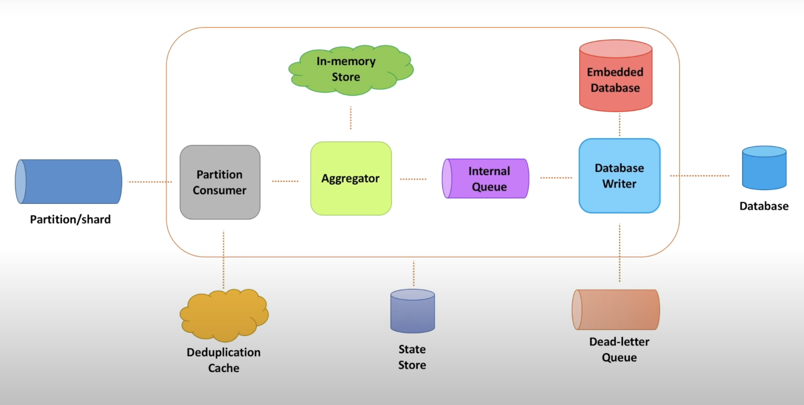

Let's look at two more important features of the database writer:
- Embeded Database and
- Dead Letter Queue
#### Dead Letter Queue:
- Whenever the Database Writer fails to write to the database either due to database being un available or any other issue, messages are stored in the DLL
- This is a way to ensure the no data is lost in the system, this is a distributed queue service
- Messages in the DLL are periodically processed and sent back to the Database writer to be pushed into the database

**Embedded Database for Data Enrichment:**
- When receiving a video event, usually the events contain very less data
- It could just be the videoId, the event type and the time stamp
- This is the case because, other information such as Video Name, Channel Name and other attributes are relatively static and can be fetched from else where
- So to ensure we format the database entry in the right manner before we store it in the database, an in memory database is present along with every processing service instance 
- This in memory database instance contains information about other attributes of a video like the name, the channel, description etc..
- So the Database Writer can append all these fields along with the aggregated content and write it to the Database
- This database residing on the same machine, eliminates the need for remote calls. LinkedIn uses this method for showing information about people who viewed your profile.

#### Improving resiliency of the Processing Service

- We keep the aggregated data in memory for some period of time.  Either in memory store or an internal queue .
- We need to understand what to do when this machine fails and this data is lost.

But we have events stored in the partition, why can we not recreate the aggregated data from the raw events ? Let's recreate state until the point it failed. 

- This is a good approach and will work fine if we we data in the in-memory store for a short period of time and the state is small
- But other times it might it might be hard to recreate the entire state from scratch using raw data from the partition
- In such cases, the solution is to store the entire in-memory data periodically to a durable storage
- This way whenever the host fails, the next instance can reload the state in memory from the durable storage and continue execution

