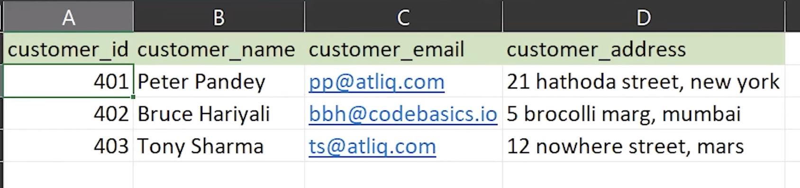

[Youtube Video](https://youtu.be/hQvCOBv_-LE)

Let's try to understand what is a fact vs a dimension table using a Grocery Store Transaction Table: 

These transaction represent events along with associated metadata. 

Further we can notice that all the information is stored in a single table, and hence this is a highly denormalized data.

When we work with Relational Tables, it is the norm to extract data about separate entities into separate tables and refer that information using a foreign key: 

For example, here we can notice that customer information is being repeated across multiple transactions: 

#### What are some issue with this approach: 
- There is a lot of data duplication - wasted memory
- If there is an issue on a later date where the customer updates their address or email, this will have to be updated in all records, across all tables that use this customer data
- This can next lead to data inconsistency
- Hence the best practice is to store customer information separately in a table

**Separate Customer Info Table with ID**

**Separate Item Table**

Each table as entries with unique ids associated with each other. Now we can associate each other with just the ID: 

Additionally what we can do is, we can create a separate table for each date, that has information about if it is a week day, or a weekend, which quarter it belonged to etc..

This way the final sales table becomes very concise and easy to maintain and further it can be linked to all the other dimensions ( extra information ) using foreign keys to the Dimension tables: 

### Star Schema

Usually in the middle we have the `Fact Table` and surrounding it we have `Dimension Tables`

And since this looks like a Star, we call it the `Star Schema`:

> In the middle we have we have the fact table, and surrounding it we have the dimension tables
> Usually the fact table has information that keeps changing on a continuous basis, but the more constant values lie in the dimension tables.

For example, we might have a 1000 new entries added the the sales table every day, but the Customer Data, Product information, Date and Region Information are not going to change at the same rate, and will remain relatively constant.

### Snowflake Schema: 

Now if we extend this concept of Fact vs Dimension Tables, we can say that, even a Given Dimension Table can have further other dimensions that can be extracted into separate tables: 

For example: 
- A customer, can have their Address as a separate Dimension, Sales Channel as a separate table

If we visualize this, it looks like a snowflake, that's why this is called Snowflake schema:

> This process of establishing the relationship between the different tables is called Data Modelling