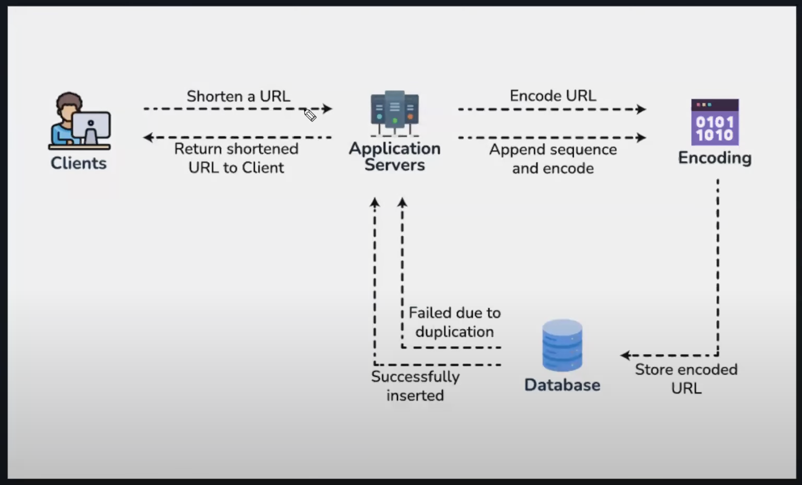

In our requirement we have the requirement that for the same long url, every request has to generate a different short url even though the input is the same. 

We can use the following work around to implement this feature: 
- Append an increasing sequence of number to the URL before hashing to ensure uniqueness
- Append a unique User ID to the URL
- In case of conflicts, regenerate the key until it is unique - this ensures that we won't need to store the previous counter for each URL - which can be discussed to check if it is required in the first place
- Another best approach would be to add the time stamp to this url, and still incase multiple requests come from various sources at the same time, we can bring in other aspects like the IP address 
- To further make our system fault proof, we can have a distributed cache with TTL for entries, we can have an incremental counter for each unique URL that the system received in the last few nano seconds
- Since the epoch time is at a nano second level, all requests for the same url at the same nano second need to be have a version number added to it, if not for the same url that arrived at a different nano second will by default generate a different hash since the timestamp value in epoch will be a different value
- We can deep dive and discuss further if there can be issues with this implementation as well

### Overall URL shortening Workflow

