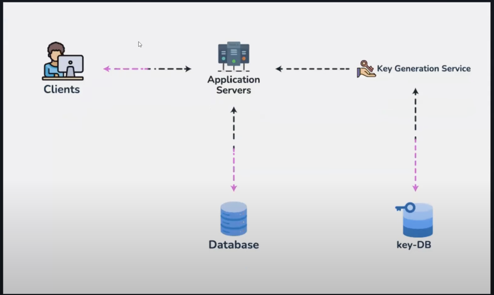

#### Offline Key Generation

Instead of generating a key based on the URL, a third party key generation service can be used that generates unique keys for every request and this can be then stored in our system.

### One good question to ask here is, if we have a separate Key Generation service, that is working in a distributed manner, how can we ensure that no two instances of the key generation service produce the same keys ?

The way to do that is by only using one instance of Key Generation Service that all URL shortening servers speak to.

By having just one instance of the key generation service, we can ensure that there is not case of key duplication or synchronization issues. 

But a followup question might be isn't this a single point of failure ?

Yes this is a single point of failure and to address this we can have some sort of durable storage that stores the current state of the KGS for say a period of 10 minutes, and incase any time the KGS goes down, the new instance of the KGS can pick up generation of keys by loading the state that the previous instance was in.

To further safeguard this system from high load, we have the URL shortener servers, request and store keys in a batch ( batch size based on load factors ) and serve individual keys from this batch and refill it when the batch gets 60% to 70% used up.

This way the load on the KGS decreases, and the latency for the Write flow also reduces. 

This can either run on the application server or can be offloaded to a proxy to the KGS that does this refilling of keys based on the usage of currently available keys. The number of proxies can be scaled up based on the load.

#### Why not use auto incrementing keys that automatically gets generated from the database ?

Check out [[11 Detailed Drawbacks of Auto-incrementing Keys for URL Shortening]]