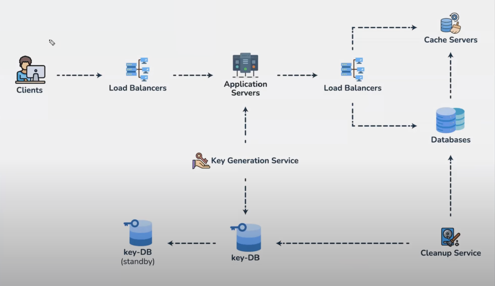

Purging the database can be done in a couple of ways: 
#### Delete on access

Whenever a user accesses an expired URL, we can send a delete command on the database and return an error

It is highly likely that people access the links for a while and then forget about it, so if no one accesses this URL, it will never be deleted from the database. 

#### Cleanup service

Just like how Redis and other caching systems run a probablistic algorithm to check randomly selected keys to check if they are expired if not purge them

#### If we have a default expiry duration

We can select all keys that would have for sure crossed the expiry time stamp based on this default value and then delete them

Here is the system at its current state:
