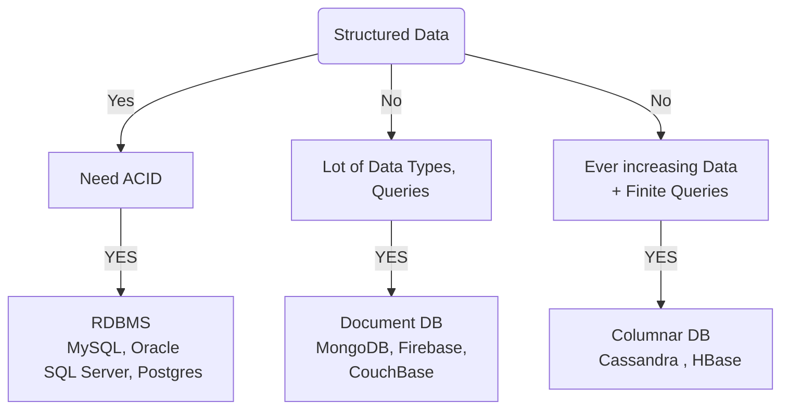

```mermaid
flowchart TD
    A(Structured Data)
    A --> |Yes| B[Need ACID]
    B --> |YES| F[RDBMS
 MySQL, Oracle
 SQL Server, Postgres]
    A --> |No| C[ Lot of Data Types, 
    Queries ]
    C --> |YES| G[Document DB
MongoDB, Firebase, 
CouchBase]
    A --> |No| D[ Ever increasing Data 
    + Finite Queries ]
    D --> |YES| E[Columnar DB
    Cassandra , HBase]
```
